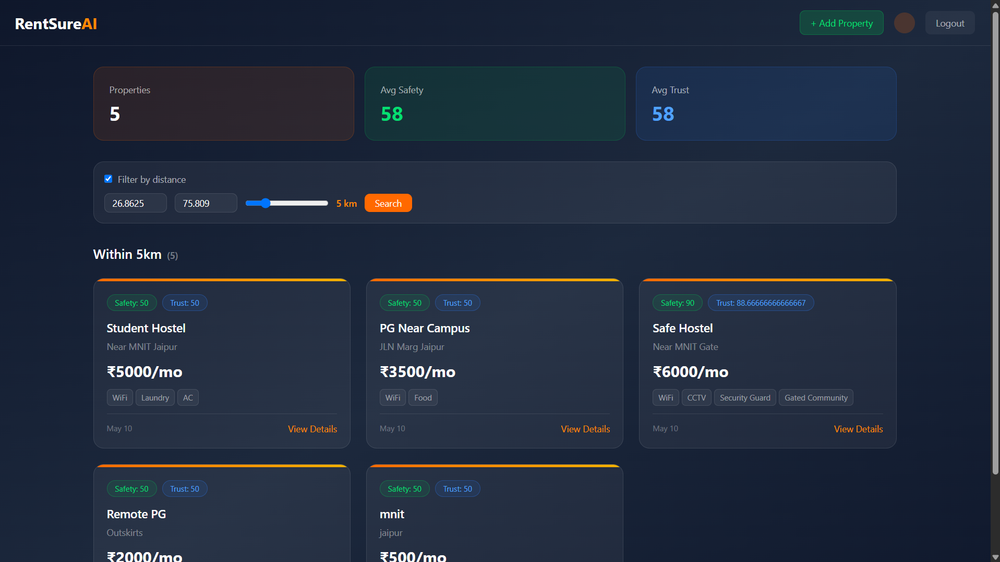
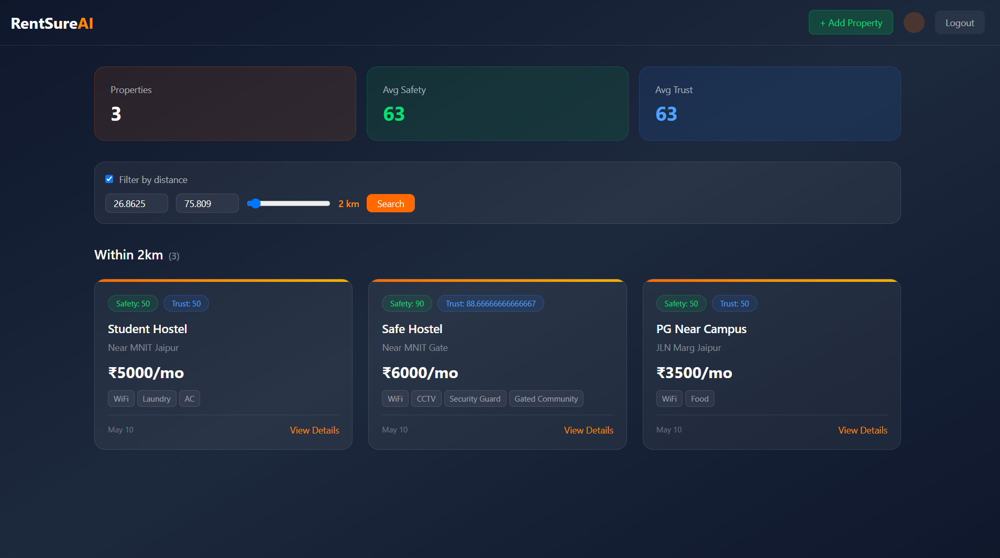
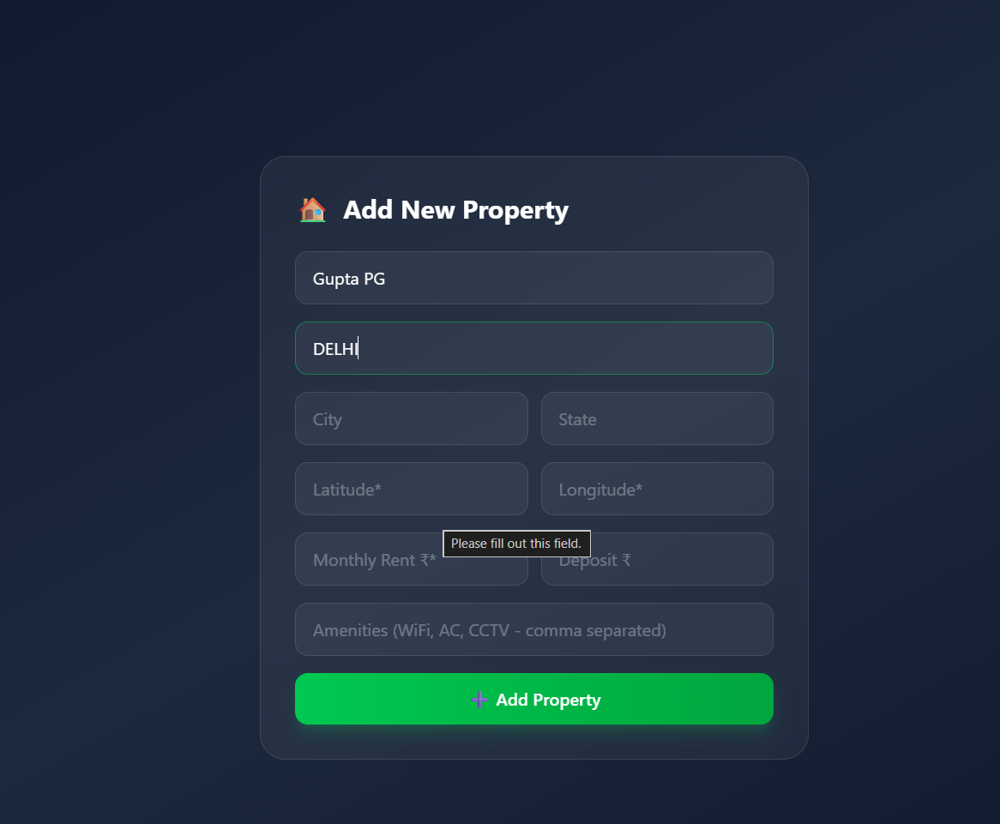

# 🏠 RentSure  – Student Housing Platform

<div align="center">

### Smart Student Housing Discovery Platform

Find safe and trusted rental properties near colleges using geospatial search, safety scoring, and trust ratings.

</div>

---

# 📌 Project Overview

RentSure AI is a full-stack MERN application designed to help students discover rental properties near their colleges.

## 🚀 Project Highlights

- JWT Authentication & Authorization
- MongoDB Geospatial Search (2dsphere)
- Safety Score Algorithm
- Trust Score Algorithm
- Role-Based Access Control
- RESTful API Architecture
- Responsive Tailwind UI

---

## 📸 Screenshots

### Dashboard



### Property Search



### Add Property



---

# 🏗 System Architecture

```text
React Client
     │
     ▼
Express REST API
     │
 ┌───┼─────────────┐
 ▼   ▼             ▼
Auth Property   Scoring
JWT  CRUD       Services
     │
     ▼
MongoDB
(2dsphere Index)
```

---

# 🛠 Tech Stack

| Layer    | Technology                  |
| -------- | --------------------------- |
| Frontend | React, Vite, Tailwind CSS   |
| Backend  | Node.js, Express            |
| Database | MongoDB                     |
| ODM      | Mongoose                    |
| Auth     | JWT, bcrypt                 |
| Security | Helmet, CORS, Rate Limiting |

---

# 📂 Project Structure

```text
RentSure_AI
├── client
├── server
├── screenshots
├── README.md
└── start.ps1
```

---

# ⚡ Getting Started

```bash
git clone https://github.com/Aakash4096/RentSure_AI.git
cd RentSure_AI

cd server
npm install
npm run dev

cd ../client
npm install
npm run dev
```

---

# 🔐 Environment Variables

```env
PORT=5000
MONGODB_URI=mongodb://localhost:27017/rentsure
JWT_SECRET=your_secret
JWT_EXPIRE=7d
```

---

# 🔮 Future Improvements

- Google Maps Integration
- Property Image Uploads
- AI Recommendations
- Real-Time Chat
- Property Reviews

---

# 👨‍💻 Developer

**Aakash Kumar**

B.Tech – Electronics & Communication Engineering

Malaviya National Institute of Technology Jaipur

GitHub: https://github.com/Aakash4096
